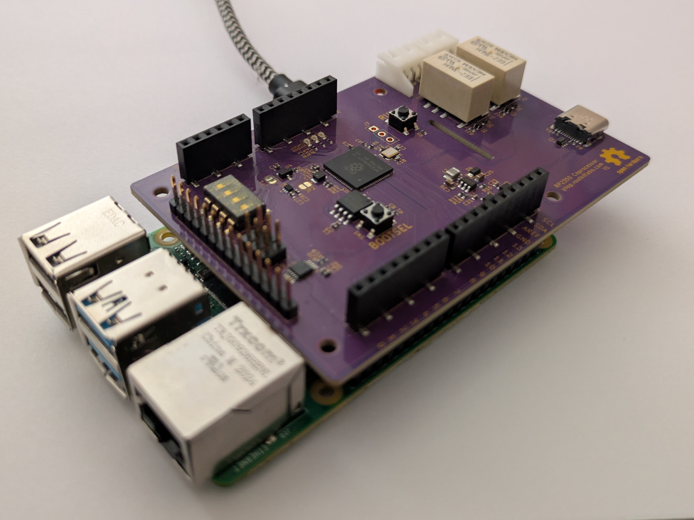

# RPI RTShield

The RTSheild is a Raspberry PI hat containing an MCU to serve as a "realtime" companion. The PI is connected to the RP2350 over a UART link, and all sensors are wired into the RP2350 itself. The RP2350 is connected to Arduino compatible headers

## IOs
- 4x Analog output (0-3.3V, 12bit)
- 8x Analog input (0-3.3V, 12bit)
- IO's (3.3V)
- 2x Relays, for dry contacts
- Switches, for config
- LEDs

## Installing
``` bash
git clone https://github.com/o7-machinehum/RTShield
cd RTShield
git submodule update --init --recursive

sudo apt update
sudo apt install -y build-essential cmake ninja-build gcc-arm-none-eabi \
    libnewlib-arm-none-eabi python3-dev python3-pybind11 openocd

make
make flash # This flashes the RP2350

sudo systemctl disable --now serial-getty@ttyS0.service
sudo usermod -aG dialout "$USER"
sudo chgrp dialout /dev/ttyS0
sudo chmod 660 /dev/ttyS0

make install
```

## Running
The Python API talks to the shield over `/dev/serial0`:

``` python
import rtshield

s = rtshield.Shield("/dev/serial0")
print(s.read_analog_raw(0))
s.write_analog_voltage(0, 1.25)
s.write_digital(2, True)
s.set_led(0, True)
s.set_relay(0, True)
print(s.read_switch(0))
```

## MCU <-> RPI Coms
It's worth mentioning the UART between the MCU and the RPI isn't done very nicely right now. This is to keep things simple. I will eventually do a proper cobs encoding scheme and make things nicer.

## License
The project is licensed under the Creative Commons (4.0 International License) Attribution—Noncommercial—Share Alike license. This allows sharing and adapting material for non-commercial purposes, provided credit is given to the creator and adaptations are shared under the same terms. The material can be used in any format with necessary technical modifications, but no warranties are provided. The license prohibits imposing additional restrictions and ensures the rights are irrevocable as long as the terms are followed.

Basically... If you make boards for yourself: great, make boards for your friends: great, but **please do not sell hundreds on them on Aliexpress**.

Files in `docs/` 3rd party reference material are not covered by this licence.
